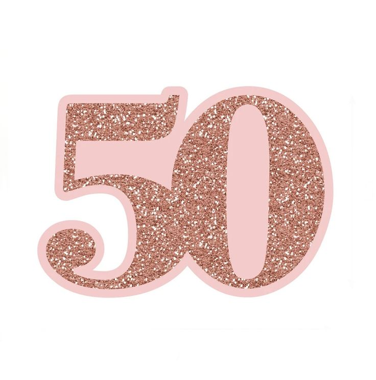

# Invitacion
@@ -0,0 +1,27 @@
<!DOCTYPE html>
<html lang="en">

<head>
    <title>MIS 50`S!!</title>
</head>
<meta charset="UTF-8" />

<marquee bgcolor="#FF7070" behavior="alternate" direction="left">
            <b> Juliza cumple 50!! </b>
        </marquee>
	
 

  <H3>Acompáñanos a celebrar a una mujer maravillosa y sus 50 vueltas al sol,
  Será a la 1:30, en la casa del río
  ¡¡¡no faltes o nos comeremos tu pastel!!! </H3>
